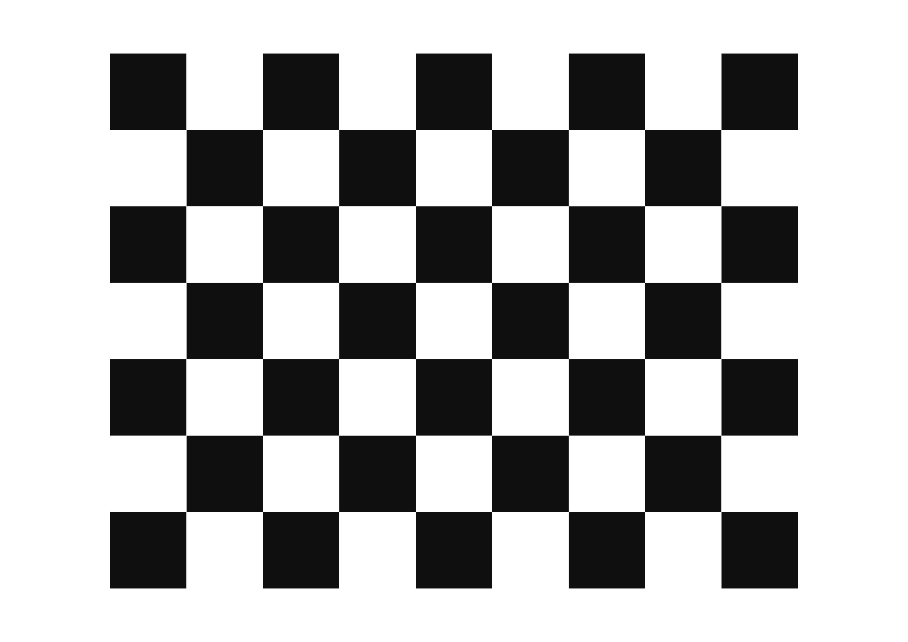

# Robotics Project

MSCV Project in Robotics using ROS and Turtlebot Burger

# Introduction
## Description of the project
This report will describe in details the project given during Master in Computer Vision's 3rd semester in Robotics. In the given scenario we had to develop an autonomous driving robot. In general, a autonomous driving robot can analyzee surrounding without any human interactions and take decisions accordingly. In order to accomplish this implementation, a number of sensors are combing andd are used to identify the pathway and road signal from the surroundings.

## What is ROS?
The Robot Operating System (ROS) is an open source middleware which contains a set of libraries,softwares and tools that are used to facilitate the development of robotic applications. There is a plethora of features from sensor drivers to state-of-the-art algorithms. As middleware, it contains characteristics of both software and hardware, hencee, it is able to perform various actions like hardware abstraction and low level control.
Until now, different version of ROS exists with some crusial differences, so for compatibility reasons we are using the Melodic release.

## Robot used for the scenario
### Turtlebot Description
For the project, the mobile robot used is a Turtlebot3 Burger. The Turtlebot3 is a compact, modular and programmable mobile robot. It uses ROS and it is able to create multiple application for training research and development.

## Scenario Description
Our goal is to complete the following scenario:

1. **Image Calibraton** is a crusial step for the fisheye camera which is integrated to Turtlebot3. The implementation uses the [camera_calibration](http://wiki.ros.org/camera_calibration) package from ROS. This packages uses OpenCV camera calibration, fully described [here](https://docs.opencv.org/2.4/modules/calib3d/doc/camera_calibration_and_3d_reconstruction.html). For this step we only have to use the checkerboard in order to get all the related coefficients for the undistortion.

2. **Lane detection** is the keystone for the robot in order to be able to move according to the lines. In the race map that we used, the inner line is the yellow line and the outter line is the white one.   
# Repository Content
## Original Code links
The original code of this project is based on the tutorial of [Turtlebot_Autorace2020](https://emanual.robotis.com/docs/en/platform/turtlebot3/autonomous_driving/#turtlebot3-autorace-2020).
All the additional related files (images, calibration files, etc.) are uploaded on this GitHub repository.

## Package installation and instructions
[Here](https://emanual.robotis.com/docs/en/platform/turtlebot3/autonomous_driving/#turtlebot3-autorace-2020) are the links that you can use in order to install all the related packages for the project.

# Original Content
In this section, we will describe the original content we had the access in the project.
<!-- 
### Setup Material

### Packages

### Basic Commands

### Projects implementation

#### ROS Navigation

#### Localization

#### Move robot

#### Lane Detection

# Instruction to run the project

## Download and install 

## Building 

## Commands

# Result 

Show the nodes that are created for this project 

# Problems encountered

### On the turtlebot

### On the remote PC

# Conclusion

# References

## Credits
 -->
