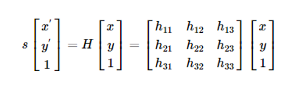

# Robotics Project

MSCV Project in Robotics using ROS and Turtlebot Burger

# Introduction
## Description of the project
This report will describe in details the project given during Master in Computer Vision's 3rd semester in Robotics. In the given scenario we had to develop an autonomous driving robot. In general, a autonomous driving robot can analyzee surrounding without any human interactions and take decisions accordingly. In order to accomplish this implementation, a number of sensors are combing andd are used to identify the pathway and road signal from the surroundings.

## What is ROS?
The Robot Operating System (ROS) is an open source middleware which contains a set of libraries,softwares and tools that are used to facilitate the development of robotic applications. There is a plethora of features from sensor drivers to state-of-the-art algorithms. As middleware, it contains characteristics of both software and hardware, hencee, it is able to perform various actions like hardware abstraction and low level control.
Until now, different version of ROS exists with some crusial differences, so for compatibility reasons we are using the Melodic release.

## Robot used for this scenario
### Turtlebot Description
For the project, the mobile robot used is a Turtlebot3 Burger. The Turtlebot3 is a compact, modular and programmable mobile robot. It uses ROS and it is able to create multiple application for training research and development.

## Scenario Description
Our goal is to complete the following scenario:

1. **Camera Calibraton** is a crusial step for the fisheye camera which is integrated to Turtlebot3. The implementation uses the [camera_calibration](http://wiki.ros.org/camera_calibration) package from ROS. This packages uses OpenCV camera calibration, fully described [here](https://docs.opencv.org/2.4/modules/calib3d/doc/camera_calibration_and_3d_reconstruction.html). For this step we only have to use the checkerboard in order to get all the related coefficients for the undistortion.

2. **Lane detection** is the keystone for the robot in order to be able to move according to the lines. In the race map that we used, the inner line is the yellow line and the outter line is the white one. To make the robot able to work we followed a "lane detection" calibration in which we set the most reliabe parameters of Hue Saturation and Value (HSV) to make the robot able to identify the `yellow` and `white` lines.
3. **Traffic Lights** is the last phase of the project. More specifically the turtlebot should be able to recognize 3 differert colors in order to get the right decision. Similarly, like the Lane Detection calibration, we adjust the aforementioned parameters for the `yellow`, `red` and `green` colours respectively.
# Repository Content
## Original Code links
The original code of this project is based on the tutorial of [Turtlebot_Autorace2020](https://emanual.robotis.com/docs/en/platform/turtlebot3/autonomous_driving/#turtlebot3-autorace-2020).
In this GitHub repository there is only the one of the misions (trafic light mission).Also, there are some additional file (images, calibration files, etc.).

## Implementation Steps
In this section, we briefly describe the packages and their dependencies that used for this project. [Here](https://emanual.robotis.com/docs/en/platform/turtlebot3/autonomous_driving/#turtlebot3-autorace-2020) are the links that you can use in order to install all the related packages for the project.

### **Step 1: Calibration**
This step is based on camera calibration in order to set the extrinsic and intrinsic calibration. All the calibration steps are integrated into nodes. Also it contains a node which calls the `raspicam_node` which used in order to publish the camera frames. We will discuss below how it works.
#### **Camera calibration**
Camera calibration is an integral part of this project. For this phase, the project uses the [camera_calibration](http://wiki.ros.org/camera_calibration) package which allows easy calibration of monocular cameras using a checkerboard calibration target. The packagess uses OpenCV library which contains the camera calibration method. 
<p align="center"></p>  

#### **Intrinsic calibration**  
As we aforementioned, it uses the [camera_calibration](http://wiki.ros.org/camera_calibration) package. This package allows easy calibration of monocular or stero cameras. The checkerboard was the tool in order to fix the *Radial Distortion* of the acquired image. *Radial or Barrel Distortion* can be presented as:

<p align="center"></p>

<p align="center"></p>


In the same manner, tangenial distortion occurs because the imaging-taking lense is not aligned perfectly parallel to the imaging plane. So, some images look nearer than expexted. The amount of tangenial distortion can be presented as below:  

<p align="center"></p>

<p align="center"></p>

According to the equation above, we can find the five paremeters, known as distortion coefficients


<p align="center"></p>

Furthermore, **intrinsic parameters** allows a mapping between camera coordinates and pixel coordinates in the image frame. They include information like local length , and optical center . This parameters can be expressed in camera matrix:

<p align="center"></p>
  
#### **Extrinsic calibration**  
It deemed as the second phase of the first stem. Extrinsic calibration defines a location and orientation of the camera with respect to the world frame. Similarly, we could state that they corresponds to rotation and translation vectors which translates a coordinates of a 3D point to a coordinate system. 

**Image Projection** gets 4 coordinates of the acquired image in order to get the projection according to these coordinates. The image projection established using homography tranformation. Homography is a transformation that is occuring between two planes. To put it briefly, it is mapping between two planar projection of an image. It is represented by 3x3 transformation matring in a homogenous coordinates space. Mathematically the homography is represented as:
<p align="center"></p>  

According to the above, in the proposed method, we set a calibration step in order to get the right coordinates to project the road containing both the yellow and white line. For this reason, we set specific top and botton corners. Then, the program add Gaussian Blur to the image. Nextly, we perform the homography transform process having the corner's coordinates. `cv2.findHomography()` is a OpenCv function that used for this reason, the documentation of this function is [here](https://www.google.com). Having the 3x3 matrix from `findHomography()` function we use the `cv2.warpPerspective()` function to get the projected image. Due to the fact that the image is projected and there is a distortion, black triangles filled these spaces on the bottom corners of the projected image.
<!-- TODO : Take a screenshot from the lab and add it as an example HERE -->

**Image Compensation** handle this using histogram equalization to improve the quality (brightness & contrast) of the groun-projected image. The histogram equalization used because of the distortion and the integration of Gaussian blur in the image. This nodes just get the projected image via the topic that the image message published. Then converts the image to a grayscale because it computationally efficient to perform histogram equalization. Lastly, using the `cv2.convertScaleAbs()` function from OpenCV, it scales, calculates absolute values and converts the result to 8-bit. To put it differently, the aforementioned function used to update the compensated image from the equalized one.

### **Step 2: Lane Detection**
As we already mentioned there are one yellow line on the right border of the lane and a white line on the left border of the lane. The desired robot's position is the center between those lines. In this step we are going to estimate this center point of the desired position.

On the previous step we set the lightness, saturation and hue parameters for each color mask (white, yellow). Now we are going to use those threshold values with a "bitwise AND operation" in order to create masks that will filter out our image and detect the border lines. 

For each line, the algorithm is going to count how many pixels there are in the range of the specified color (if any) and adjust the reliability of the line. Reliability, is like a measurement of how much "recognized" is the line. For example, if the line is short or not recognised the reliability should be small and the robot should follow the other line. On the other hand if the reliability is high the robot should count on this line.

The best scenario is when both of the lines are highly recognizable, concluding to high reliability, so that the algorithm is counting on both of lines. Finally, we estimate a center point between the lines, representing the robot's desired position. 

### **Step 3: Lane Following**
The controller of the robot is receiving the desired center position of the robot and converts it to error variable:  
```python
error = center - 500
```  

The angular velocity is being adjusted by the controller while the linear velocity is constant:  
```python
linear_x = 0.05
```  

This error variable, multiplied by some constants, is used to feed the PD (Proportional-Derivative) Controller angular velocity:  
```python
Kp = 0.0025
Kd = 0.007
angular_z = Kp * error + Kd * (error - self.lastError)
```  

The error is being multiplied by Kp, added with the substraction of the current error from the previous error multiplied by Kd. 

This approach is a very easy implementation of the PD Controller.

The last important checkpoint before publishing the values to the robot, is that every robot has some minimum and maximum motor velocity. For this reason we are going to limit the angular velocity between -2.0 to 2.0:  
```python
angular.z = -max(angular_z, -2.0) if angular_z < 0 else -min(angular_z, 2.0)
```

Finally, we publish the velocities to the robot using the `cmd_vel` topic.

# Original Content
In this section, we will describe the original content we had the access in the project.
<!-- 
### Setup Material

### Packages

### Basic Commands

### Project's implementation

#### ROS Navigation

#### Move robot

#### Lane Detection

# Instruction to run the project

## Download and install 

## Building 

## Commands

# Result 

Show the nodes that are created for this project 

# Problems encountered

### On the turtlebot

### On the remote PC

# Conclusion

# References

## Credits
 -->
