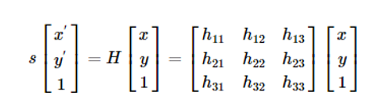
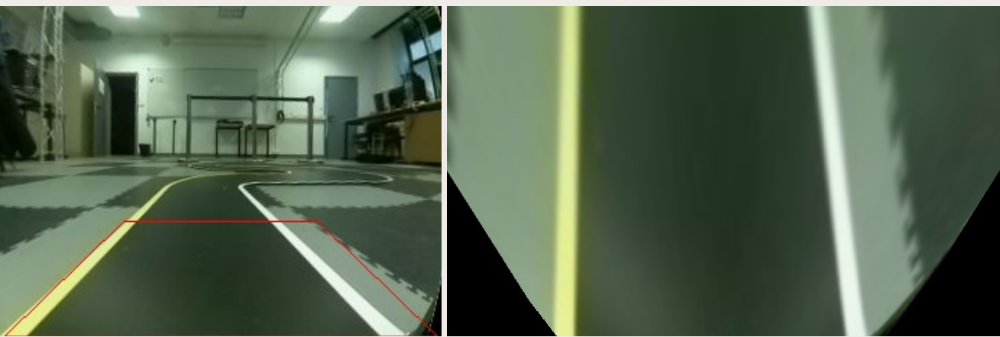
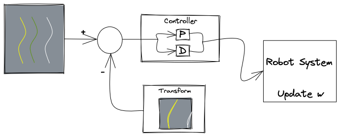
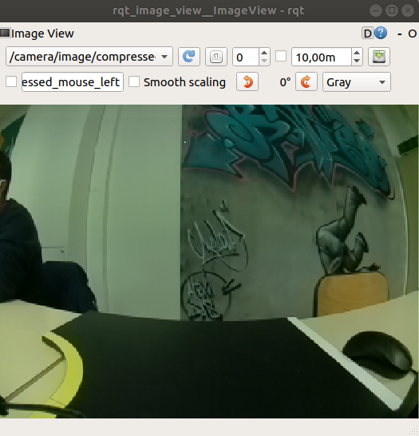
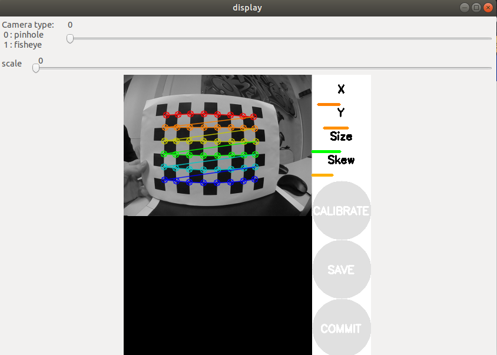
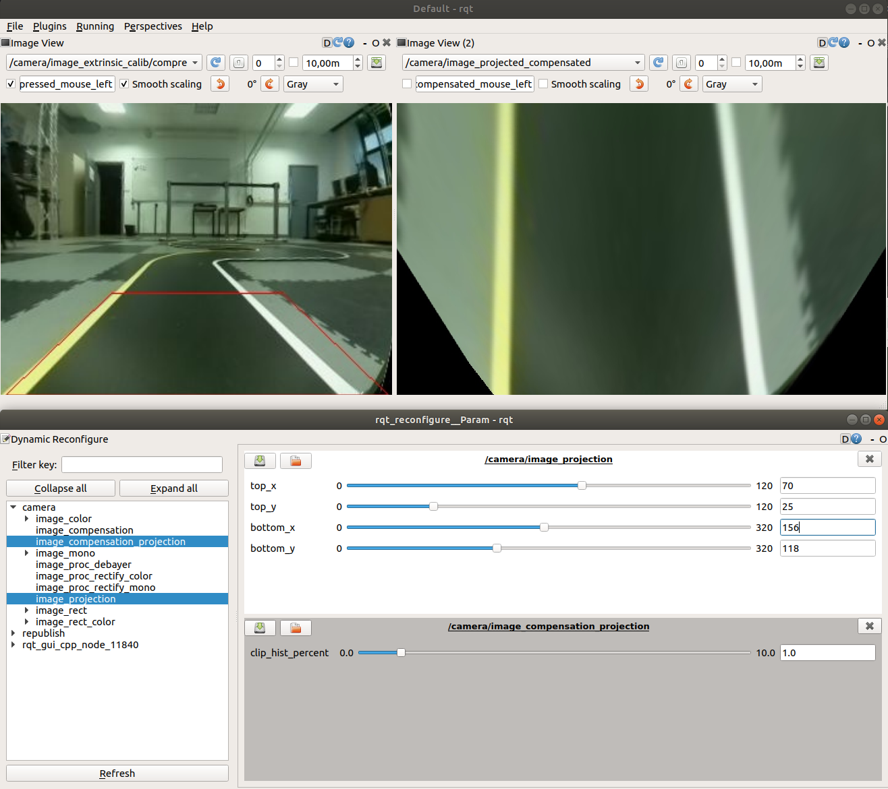
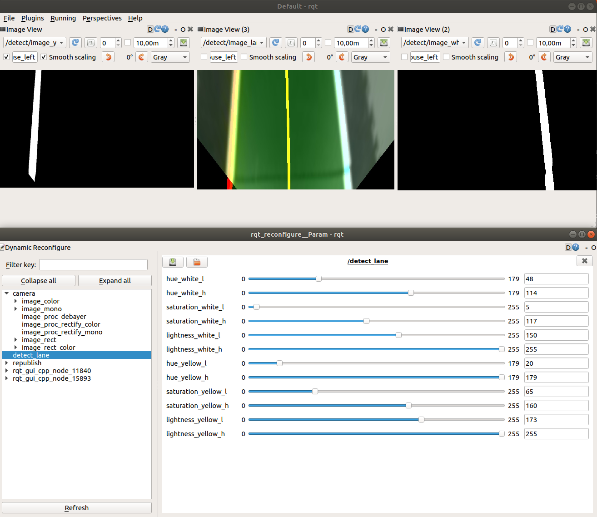

# Robotics Project

MSCV Project in Robotics using ROS and Turtlebot Burger

# Introduction
## Description of the project
This report will describe in detail the project given during Master in Computer Vision's 3rd semester in Robotics. In the given scenario we had to develop an autonomous driving robot. In general, an autonomous driving robot can analyze surrounding without any human interactions and take decisions accordingly. To accomplish this implementation, several sensors are combing and are used to identify the pathway and road signal from the surroundings.

## What is ROS?
The Robot Operating System (ROS) is an open-source middleware that contains a set of libraries, software, and tools that are used to facilitate the development of robotic applications. There is a plethora of features from sensor drivers to state-of-the-art algorithms. As middleware, it contains characteristics of both software and hardware, hence, it can perform various actions like hardware abstraction and low-level control.
Until now, a different version of ROS exists with some crucial differences, so for compatibility reasons we are using the Melodic release.

## Robot used for this scenario
### Turtlebot Description
For the project, the mobile robot used is a Turtlebot3 Burger. The Turtlebot3 is a compact, modular and programmable mobile robot. It uses ROS and it can create multiple applications for training research and development.

## Scenario Description
Our goal is to complete the following scenario:

1. **Camera Calibration** is a first step for the fisheye camera which is integrated into Turtlebot3. The implementation uses the [camera_calibration](http://wiki.ros.org/camera_calibration) package from ROS. This package uses OpenCV camera calibration, fully described [here](https://docs.opencv.org/2.4/modules/calib3d/doc/camera_calibration_and_3d_reconstruction.html). For this step, we only have to use the checkerboard to get all the related coefficients for the undistortion (Intrinsic Calibration). Then, using the undistorted image, we perform extrinsic calibration related to the ground-projection combined with image compensation for better quality of the projected image. 

2. **Lane detection** is a keystone for the robot in order to be able to move according to the lines. In the race map that we used, the inner line is the yellow line and the outer line is the white one. To make the robot able to work we followed a "lane detection" calibration in which we set the most reliabe parameters of Hue Saturation and Value (HSV) to make the robot able to identify the `yellow` and `white` lines.
3. **Lane Following** is the last phase in which we implement the PD controller. The trajectory of the robot is performed according to both PD controller and the detected lane.
<!-- 3. **Traffic Lights** is the last phase of the project. More specifically the turtlebot should be able to recognize 3 differert colors in order to get the right decision. Similarly, like the Lane Detection calibration, we adjust the aforementioned parameters for the `yellow`, `red` and `green` colours respectively. -->
# Repository Content
## Original Code links
The original code of this project is based on the tutorial of [Turtlebot_Autorace2020](https://emanual.robotis.com/docs/en/platform/turtlebot3/autonomous_driving/#turtlebot3-autorace-2020).
In this GitHub repository, there is only one of the missions (traffic light mission). Also, there are some additional files (images, calibration files, etc.).

## Implementation Steps
In this section, we briefly describe the packages and their dependencies used for this project. [Here](https://emanual.robotis.com/docs/en/platform/turtlebot3/autonomous_driving/#turtlebot3-autorace-2020) are the links that you can use in order to install all the related packages for the project.

### **Step 1: Calibration**
This step is based on camera calibration to set the extrinsic and intrinsic calibration. All the calibration steps are integrated into nodes. Also, it contains a node which calls the `raspicam_node` which is used to publish the camera frames. We will discuss below how it works.
#### **Camera calibration**
Before we continue with Intrinsic and extrinsic calibration, there is the common step in which we can modify some parameters for the camera such as Sharpness, Contrast, etc. 

#### **Intrinsic calibration**  
Camera calibration is an integral part of this project. For this phase, the project uses the [camera_calibration](http://wiki.ros.org/camera_calibration) package which allows easy calibration of monocular cameras using a checkerboard calibration target. The packagess uses OpenCV library which contains the camera calibration method. 
<p align="center"></p>  
As we aforementioned, it uses the [camera_calibration](http://wiki.ros.org/camera_calibration) package. This package allows easy calibration of monocular or stero cameras. The checkerboard was the tool in order to fix the *Radial Distortion* of the acquired image. *Radial or Barrel Distortion* can be presented as:

<p align="center"></p>

<p align="center"></p>


In the same manner, tangenial distortion occurs because the imaging-taking lense is not aligned perfectly parallel to the imaging plane. So, some images look nearer than expexted. The amount of tangenial distortion can be presented as below:  

<p align="center"></p>

<p align="center"></p>

According to the equation above, we can find the five parameters, known as distortion coefficients


<p align="center"></p>

Furthermore, **intrinsic parameters** allows a mapping between camera coordinates and pixel coordinates in the image frame. They include information like local length , and optical center . This parameters can be expressed in camera matrix:

<p align="center"></p>
  
#### **Extrinsic calibration**  
It is deemed as the second phase of the first stem. Extrinsic calibration defines the location and orientation of the camera concerning the world frame. Similarly, we could state that they correspond to rotation and translation vectors which translates coordinates of a 3D point to a coordinate system. 

**Image Projection** gets 4 coordinates of the acquired image to get the projection according to these coordinates. The image projection was established using homography transformation. Homography is a transformation that is occurring between two planes. To put it briefly, it is mapping between two planar projections of an image. It is represented by 3x3 transformation matrix in a homogenous coordinates space. Mathematically the homography is represented as:
<p align="center"></p>  

According to the above, in the proposed method, we set a calibration step in order to get the right coordinates to project the road containing both the yellow and white line. For this reason, we set specific top and bottom corners. Then, the program adds Gaussian Blur to the image. Nextly, we perform the homography transform process having the corner's coordinates. `cv2.findHomography()` is a OpenCv function that is used for this reason, the documentation of this function is [here](https://www.google.com). Having the 3x3 matrix from `findHomography()` function we use the `cv2.warpPerspective()` function to get the projected image. Since the image is projected and there is a distortion, black triangles filled these spaces on the bottom corners of the projected image.
<!-- TODO : Take a screenshot from the lab and add it as an example HERE -->
<p align="center"></p>

**Image Compensation** handle this using histogram equalization to improve the quality (brightness & contrast) of the ground-projected image. The histogram equalization used because of the distortion and the integration of Gaussian blur in the image. These nodes just get the projected image via the topic that the image message published. Then converts the image to grayscale because it is computationally efficient to perform histogram equalization. Lastly, using the `cv2.convertScaleAbs()` function from OpenCV, it scales, calculates absolute values and converts the result to 8-bit. To put it differently, the aforementioned function is used to update the compensated image from the equalized one.

### **Step 2: Lane Detection**
As we already mentioned there is one yellow line on the right border of the lane and a white line on the left border of the lane. The desired robot's position is the center between those lines. In this step, we are going to estimate this center point of the desired position.

In the previous step, we set the lightness, saturation, and hue parameters for each color mask (white, yellow). Now we are going to use those threshold values with a "bitwise AND operation" in order to create masks that will filter out our image and detect the borderlines. 

For each line, the algorithm is going to count how many pixels there are in the range of the specified color (if any) and adjust the reliability of the line. Reliability is like a measurement of how much "recognized" is the line. For example, if the line is short or not recognized the reliability should be small and the robot should follow the other line. On the other hand, if the reliability is high the robot should count on this line.

The best scenario is when both of the lines are highly recognizable, concluding to high reliability so that the algorithm is counting on both lines. Finally, we estimate a center point between the lines, representing the robot's desired position. 

### **Step 3: Lane Following**
The controller of the robot is receiving the desired center position of the robot and converts it to an error variable:  
```python
error = center - 500
```  

The angular velocity is being adjusted by the controller while the linear velocity is constant:  
```python
linear_x = 0.05
```  

This error variable, multiplied by some constants, is used to feed the PD (Proportional-Derivative) Controller angular velocity:  
```python
Kp = 0.0025
Kd = 0.007
angular_z = Kp * error + Kd * (error - self.lastError)
```  

The error is being multiplied by Kp, added with the subtraction of the current error from the previous error multiplied by Kd. 

This approach is a very easy implementation of the PD Controller.

The last important checkpoint before publishing the values to the robot is that every robot has some minimum and maximum motor velocity. For this reason, we are going to limit the angular velocity between -2.0 to 2.0:  
```python
angular.z = -max(angular_z, -2.0) if angular_z < 0 else -min(angular_z, 2.0)
```

<p align="center"></p>

Finally, we publish the velocities to the robot using the `cmd_vel` topic.

# Instruction to run the turtlebot  
In this section, there is fully explained instruction of how to perform calibration ,and then how to move the robot. To clarify, there are two different machines (remote PC and turtlebot) in which we should perform all the commands.  
## System and software requirements
This project have been tested in `Ubuntu 16.04` with `ROS Kinetic` and `Ubuntu 20.04` with `ROS Melodic` respectively.
In this project we used:
* Turtlebot 3 Burger
* Remote PC
* Raspberry Pi Camera module
* The autorace track
## Environment - Autorace Packages Setup

The bash block below should be executed in both `Remote PC` and `Turtlebot3`
```bash
roscd ; cd ../src
git clone https://github.com/manoskout/robotics_project.git
cd ~/catkin_ws && catkin_make
```
After that, you should also install some additional dependencies on `Remote PC`
```bash
sudo apt-get install ros-kinetic-image-transport ros-kinetic-cv-bridge ros-kinetic-vision-opencv python-opencv libopencv-dev ros-kinetic-image-proc
```
Then, the next step is camera calibration.
## Calibration 

### **Imaging Calibration**
In this step, we set appropriate values according to the contrast, sharpness, brightness, etc. of the image to get clear images from the camera. This step is optional if the image is clear beforehand.
1. Launch roscore on `Remote PC`
```bash
roscore
```
2. Enable the `raspi_cam`  publisher on `Turtlebot`
```bash
roslaunch turtlebot3_autorace_traffic_light_camera turtlebot3_autorace_camera_pi.launch
```
3. Until now, there is a publisher on the Turtlebot which publishes the images on the topic `/camera/image/` or `/camera/image/compressed`, and the remote PC which runs the `roscore` and it is able to share information with the Turtlebot. To ensure that the publisher works correctly, you can execute the rqt_image_view on the `Remote PC`. Then, on the checkbox, you can find all the related topics that share image messages.  
```bash
rqt_image_view
```  
<p align="center"></p>  
4. Execute `rqt_reconfigure` on `Remote PC`  
`rqt_reconfigure` is a rqt plugin that provides GUI to reconfigure the parameters. This can be performs only if the parameters are accessible via the `dynamic_reconfigure`.  

```bash
rosrun rqt_reconfigure rqt_reconfigure
```

The in the pop-up window you should select the camera to modify the parameters.
When you change the parameters, you should modify the file which is located: **robotics_project/turtlebot3_autorace_traffic_light/turtlebot3_autorace_traffic_light_camera/calibration** folder.  

> **_Note:_** In case that you have already launched the roscore and the camera publisher from the previous step you do not have to relaunch them.

<p align="center"><image src="img/instr/rqt_camera_calib.png"/></p>

### **Intrinsic Calibration**

Having printed the checkerboard on A4 size paper, you will use this checker board for Intrinsic Calibration. 
<!-- Add the checkerboard here -->
1. Launch roscore on `Remote PC`

2. Enable the `raspi_cam`  publisher on `Turtlebot`
```bash
roslaunch turtlebot3_autorace_traffic_light_camera turtlebot3_autorace_camera_pi.launch
```
1. Launch the intrinsic camera calibration launch file on `Remote PC`
```bash
export AUTO_IN_CALIB=calibration
export GAZEBO_MODE=false
roslaunch turtlebot3_autorace_traffic_light_camera turtlebot3_autorace_intrinsic_camera_calibration.launch
```
> **_Note:_** the `AUTO_IN_CALIB` is responsible for the mode that the intrinsic calibration launch file will be launched.
This launch file will run the `camera_calibration` package if the mode is in calibration. Moving the checkerboard in front of the camera it will acquire all the patterns that it needs for all the axis. When it will get all the required patterns, you should click on the calibrate button. After a while, the **save** button will be enabled.  
<p align="center"></p>  

> **_Note:_** the output of the save button is **calibration.tar.gz** file, you should extract only the **ost.yaml** file which contains all the parameters that we need.  

4. Copy and paste the data from **ost.yaml** to **camerav2_320x240_30fps.yaml** which is located `/robotics_project/turtlebot3_autorace_traffic_light/turtlebot3_autorace_traffic_light_camera/calibration/intrinsic_calibration

### **Extrinsic Calibration**
In this phase, as we described in the theoretical part we are going to project the ground which shows the road in which the robot is.

1. Launch roscore on `Remote PC`

2. Enable the `raspi_cam`  publisher on `Turtlebot`
```bash
roslaunch turtlebot3_autorace_traffic_light_camera turtlebot3_autorace_camera_pi.launch
```
3. Launch the intrinsic calibration, but in action mode because you finished the previous step
```bash
export AUTO_IN_CALIB=action
export GAZEBO_MODE=false
roslaunch turtlebot3_autorace_traffic_light_camera turtlebot3_autorace_intrinsic_camera_calibration.launch
```

4. Run the extrinsic calibration launch file on `Remote PC`
```bash
export AUTO_EX_CALIB=calibration
roslaunch turtlebot3_autorace_traffic_light_camera turtlebot3_autorace_extrinsic_camera_calibration.launch
```  

<p align="center"></p>  

> **_Note:_** the `AUTO_EX_CALIB` is responsible for the mode that the extrinsic calibration launch file will be launched.
5. Run rqt on `Remote PC`
```bash
rqt
```
In the pop-up window, navigate to the **plugins>visualization>Image View**. Using that you can create multiple image views for different image topics.
From the previous step, having the calibration mode enabled we are publishing two topics:
* **/camera/image_extrinsic_calib/compressed** : which is the current image with a red border. This red border is according to 4 image coordinates and it states the projected image.
  <!-- Add an image -->
* **/camera/image_projected_compensated** : is the projected output. It worth noting that the topic contains the word *compensated* which is the image processing step to improve the quality of th image. 
  <!-- Add an image -->
6. To reconfigure the coordinates of the projected frame (edit the red boarder), we should also launch the `rqt_reconfigure` by executing the following command:
```bash
rosrun rqt_reconfigure rqt_reconfigure
```
   * The `image_projection` node which is into the `turtlebot3_autorace_extrinsic_camera_calibration.launch` file load all the parameters about the aforementioned coordinates from the `/calibration/extrinsic_calibration/projection.yaml`. In calibration mode, it reads the parameters from the `rqt_reconfigure` through the Dynamic Reconfigure. From the camera dropdown, select the `image_compensation_projected` and from the `image_mono`, select the `image_projection`.
     * **image_compensation_projected** has the `clip_hist_percent` which is a clip limit to limit the maximum slope in the transform function. More specifically, it limits the maximum number of samples per bin in each tile, and the clipped samples are then redistributed uniformly because the CDF must be normalized yo [0,1].
     * **image_projection** has 4 different parameters, one for each corner. 
     <!-- Add and image -->
7. Lastly, you should go to the `/turtlebot3_autorace_traffic_light/turtlebot3_autorace_traffic_light_camera/calibration/extrinsic_calibration/projection.yaml` and update the parameters that you modify. Also, in the same directory there is the `compensation.yaml` file and you can modify the `clip_hist_percent` if you have changed the value.
<!-- Add an image -->
### **Check Calibration**
When you will have finished the camera calibration step according to the instruction above, You should follow the instructions below to check the results of your calibration.
1. If you have closed the roscore, you should rerun it to establish communication between the turtlebot and the Remote PC. Hence, run the `roscore` command on `Remote PC`
2. Similarly, the raspberry pi camera publisher should be enabled if you have disabled it. Run-on `Turtlebot`
```bash
roslaunch turtlebot3_autorace_traffic_light_camera turtlebot3_autorace_camera_pi.launch
```
3. Run the instrinsic camera caliration launch file on `Remote PC`
```bash
export AUTO_IN_CALIB=action
roslaunch turtlebot3_autorace_traffic_light_camera turtlebot3_autorace_intrinsic_camera_calibration.launch
```
>**_Note_:** It should be noticed that in this bash block, we define the environment variable AUTO_IN_ACTION equals to action, which means that it will not follow the calibration phase, but it will set the updated parameters from the `yaml` file.  
4. In the same manner, we will launch the extrinsic camera calibration on `Remote PC`
```bash
export AUTO_EX_CALIB=action
roslaunch turtlebot3_autorace_traffic_light_camera turtlebot3_autorace_extrinsic_camera_calibration.launch
```
<!-- SHOW THE OUTPUT AFTER THIS COMMANDS -->
### **Lane Detection Calibration**
The next phase is related to the detection of lines. As we clarified in the previous section, the lines will be a guidance of the Turtlebot. Thus, the camera should be well-calibrated in how to identify both yellow and white lines. Before we start this step, you should be sure that the **yellow line is placed on the left side** of the robot and the **white line on the right side** respectively.
1. You should rerun all the previous commands on the **Check Calibration** step which publishes the projected image.
2. Then, you should also trigger the *lane detection* launch file on `Remote PC`:
```bash
export AUTO_DT_CALIB=calibration
roslaunch turtlebot3_autorace_traffic_light_detect turtlebot3_autorace_detect_lane.launch
```
Similarly, here we used the `AUTO_DT_CALIB` which is responsible for what mode we will set the `detect_lane` node to execute a specific group of functions for calibration.
3. Also for this step, we need to execute `rqt` on `Remote PC` to get the published messages of the detect_lane node. Then, in the rqt dialog we create *Image Views* by clicking **plugins>visualization>Image view**. There are three topics that this node publishes.
   * **/detect/image_yellow_lane_marker/compressed** is a filtered image
   * **/detect/image_white_lane_marker/compressed** is a filtered image
   * **/detect/image_lane/compessed** is the output of the detected lines containing the center lane which is responsible for the robot's trajectory
4. Execute the rqt_reconfigure on `Remote PC`
```bash
rosrun rqt_reconfigure rqt_reconfigure
```
<p align="center"></p>
After that, in the shown dialog, there is a set of parameters called `detect_lane. This dialog contains HSV parameters related to both the yellow and white lanes. 
<!-- Add an image showing the dialog of this command -->
> **_Note_:** Due to the fact that the physical environment interferes with the line detection process, line color filtering is difficult. The modified parameters will interact differently throughout the day (because of the luminance)  
> 
>   
> **_HSV-HSL explanation_:** 
> * Hue (H): means the color, each color has its own region of the value, [here](https://en.wikipedia.org/wiki/HSL_and_HSV) are information about the color regions.  
> * Saturation (S): means the ratio of colorfulness to the brightness  
> * Value or Lightness (V or L): is the average of the largest and smallest color components.  
> **_Line Calibration_**: As the [tutorial](https://emanual.robotis.com/docs/en/platform/turtlebot3/autonomous_driving/) mentioned, is better to start by modifying the Hue to find the white and yellow colors which have their own regions. Then, calibrate the low - high value of Saturation. Lastly, calibrate the lightness low - high value. It is worth noting that on the `detect_lane` node there is an auto-adjustment function, so calibrating lightness low value is meaningless.  
5. After the colour calibration, go to the **lane.yaml** file and update the values that corresponds to a better line detection. The path of this file is on **/robotics_project/turlebot3_autorace_traffic_light/turtlebot3_autorace_traffic_light_detect/param/lane**
<!-- Add an image showing the dialog of this command -->
6. Close both `rqt_reconfigure` and `turtlebot3_autorace_detect_lane`

## Detect lane mission
The commands below will perform the lane detection mission. You can continue from the previous step or you should rerun the `roscore`, `raspberry pi cam`, and `intrinsic and extrinsic calibration.
1. Run this command on `Remote PC`:
```bash
export AUTO_DT_CALIB=action
roslaunch turtlebot3_autorace_traffic_light_detect turtlebot3_autorace_detect_lane.launch
```
> **_Note_:**The `AUTO_DT_CALIB` is also an environment variable that defines in which mode the `detect_lane` will be launched
2. Execute the command that enables the velocity topic in the Turtlebot, called `/cmd_vel`.
```bash
roslaunch turtlebot3_bringup turtlebot3_robot.launch
```  
3. The step is related to the velocity manipulation through the PD controller which is integrated into the project. To perform this step, just execute the command below:
```bash
roslaunch turtlebot3_autorace_traffic_light_control turtlebot3_autorace_control_lane.launch
```
This launch file enables the `control_lane` node. It subscribes to the `/detect/lane` topic which contains the `center`, setting the robot between the yellow and the white line by updating the `/cmd_vel` topic which updates the linear and angular velocity of the Turtlebot.

# Results
<!-- Add a video related to the commands above -->
Due to the lightness changes throughout the day, the modifications of the HSV value for the Detect Lane calibration are continuous. After a plethora of experiments, we found the most appropriate values, making the robot able to follow the lane. The video below shows the results of the autorace robot.
[This link](https://drive.google.com/file/d/18MEHNkZ5sAiVhV4xFWQW4ufk0lJ2UDF5/view?usp=sharing), contains the final experiment with the parameters that exist on the instructions above. Below, there is a fast forward of this experiment.

<p align="center"><video src="https://user-images.githubusercontent.com/32570934/145036418-96758803-a693-4ece-92fe-4b40159151ef.mp4" data-canonical-src="https://user-images.githubusercontent.com/32570934/145036418-96758803-a693-4ece-92fe-4b40159151ef.mp4" controls="controls"></p>

According to this video, some limitations cannot be denied. In the list below, there is an explanation for each of those limitations.

## Lightness - Noise
It should be noticed that the line is well detected but sometimes it recognizes the white line as yellow. This issue exists because of the lightness auto adjustment and the noise that the image contains.
<p align="center"></p>

## Tunnel 
In the mission of the tunnel, It works fine according to the camera video, although, during the passing of the tunnel, the turtlebot is missing the lines (in small periods). This is caused due to the lack of lightness. Thankfully, this can be partially handled, when the robot detects even one line which auto-adjusts the center according to one line.


<p align="center"><video src="https://user-images.githubusercontent.com/32570934/145586587-8f168bd0-09e9-4cf4-befe-0d5b50133a78.mp4" controls="controls"></p>


## Continuous Calibration for the line detection
Since the lightness of the environment tends to change during the day, line detection calibration is essential in order to prevent misfunction throughout the race. To confront this issuewe could define different sets of line detecttion parameters for different occasions but it is not an ideal sollution. Alternatively, we can use edge detection instead of colour detection but we should change the deciding part which used to move the robot according to the center of these lines.

# Conclusion
This project was based on the [Autonomous Driving Tutorial by Robotis](https://emanual.robotis.com/docs/en/platform/turtlebot3/autonomous_driving/), containing only the Line Following mission. It is briefly introduce simple line following detection using colour picking.
<!-- Check this sentence again -->
<!--

# References

 -->
